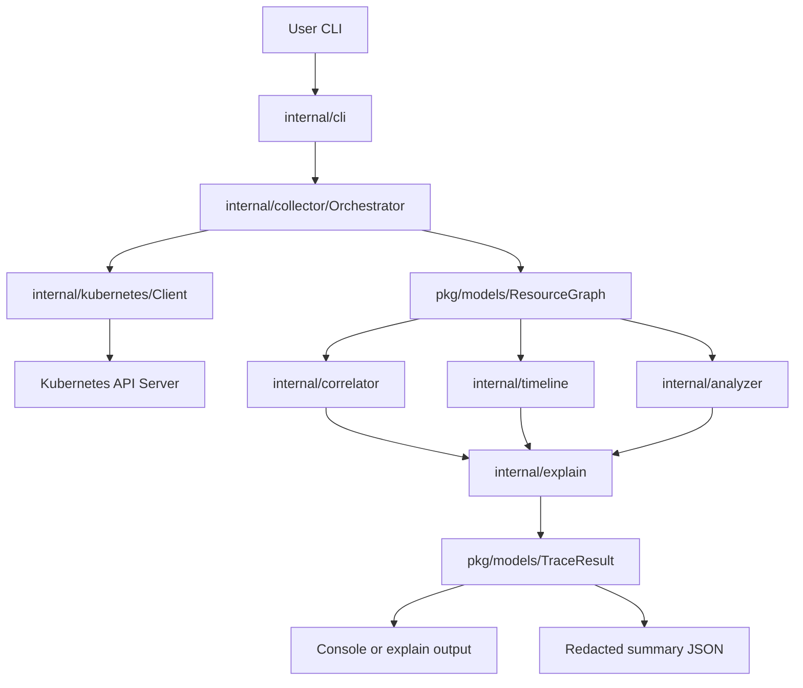
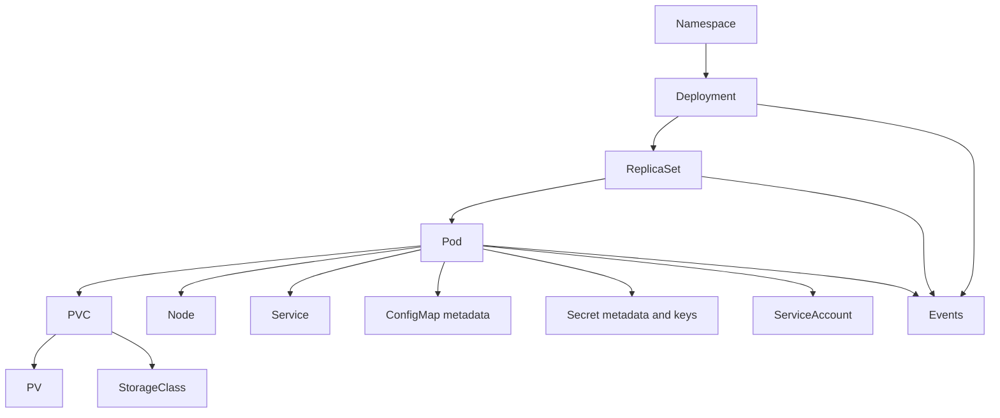

# ktrace Architecture

This document describes the v0.3 evidence-driven workload diagnostic pipeline.

## Mission

ktrace answers three questions for any Kubernetes resource:

1. **What happened?** — chronological timeline of events and state changes
2. **Why did it happen?** — graph-aware causal diagnosis with confidence
3. **What should I fix?** — evidence-backed, actionable recommendations

## Package Map

### Current (v0.3)

| Package | Responsibility |
|---------|----------------|
| `cmd/ktrace` | CLI entrypoint |
| `internal/cli` | Cobra commands and flags |
| `internal/engine` | Analysis pipeline orchestration |
| `internal/collector` | Resource collectors and graph walk |
| `internal/correlator` | Explicit resource edges |
| `internal/timeline` | Chronological timeline builder |
| `internal/analyzer` | Modular failure detection rules |
| `internal/explain` | Root-cause selection and status |
| `internal/renderer/console` | Human-readable report output |
| `internal/kubernetes` | Kubernetes client wrapper |
| `internal/runtime` | Installation/runtime detection and contextual errors |
| `internal/redact` | Credential redaction for all output paths |
| `pkg/models` | Domain types including `TraceResult` |

### Planned (Phase 3+)

| Package | Responsibility |
|---------|----------------|
| `internal/renderer` | Markdown, HTML output |
| `internal/cache` | Optional collection cache |
| `internal/exporter` | PDF, Slack, GitHub Actions export |

## Data Flow



## Collection Graph

The orchestrator can start from Deployment, ReplicaSet, Pod, Namespace,
StatefulSet, DaemonSet, Job, or CronJob. A deployment walk includes:



Discovery mechanisms:

- **Owner references** — Deployment → ReplicaSet → Pod
- **Pod spec** — PVC claim names, nodeName
- **PVC spec** — bound PV name
- **Service selectors** — match Pod labels
- **Events API** — involvedObject name/UID matching
- **Configuration references** — environment, volumes, service accounts, and image pull secrets
- **Upward owner walk** — Pod → ReplicaSet/Job → Deployment/CronJob

## Collector Design

Each resource kind has its own file in `internal/collector/`:

- `deployment.go`, `replicaset.go`, `pod.go`, `workload.go`
- `event.go`, `pvc.go`, `pv.go`, `node.go`, `service.go`, `namespace.go`
- `references.go` — metadata-only configuration dependency resolution
- `logs.go` — opt-in, bounded, redacted failed-container logs
- `orchestrator.go` — coordinates the walk from a root resource

Collectors return `models.CollectedResource` snapshots plus explicit
`ResourceReference` records. Secret values and ConfigMap values are not
retained. Collection has a deadline and resource budget; RBAC denials,
truncation, and optional evidence failures produce a partial result rather than
a false Healthy status.

## Extension Points

### Correlator and causal diagnosis

The correlator adds explicit ownership, scheduling, storage, service, and
configuration-reference edges:

```go
type Edge struct {
    From     models.ResourceRef
    To       models.ResourceRef
    Relation string // "owns", "scheduled", "mounts", "selects", "references-secret"
}
```

`internal/explain` ranks findings by severity, causal specificity, graph
position, and event order. `Diagnosis` separates the likely root cause,
contributing causes, and downstream symptoms and includes an evidence chain.

### Analyzer

Analyzers register as functions over the graph:

```go
type Rule func(graph *models.ResourceGraph) []Finding
```

Each rule detects a condition (e.g. `CrashLoopBackOff`), explains it, and suggests fixes.

### Renderer and output safety

Console and explain renderers receive `TraceResult`. `--json` emits the stable
`ktrace.dev/v1alpha1` summary schema; `--include-raw` is explicit. Every output
path applies credential redaction.

## Error Handling

- Collectors wrap API errors; `NotFound` becomes `pkg/errors.ErrNotFound`
- CLI exits: `0` healthy, `2` usage, `3` findings, `4` partial/unknown, `5` API/connection error
- All network calls accept `context.Context` for cancellation
- Secondary evidence failures become warnings and set status to `Unknown`

## Testing

- Unit tests use `client-go/fake` clientset with programmatic fixtures
- Orchestrator integration test validates full graph collection
- Benchmarks cover orchestrator and event collection paths
- Kind integration scenarios cover missing config, init/probe/OOM failures, failed Jobs, and StatefulSet storage

## Security

- Uses standard kubeconfig / in-cluster credentials (same as kubectl)
- Read-only API access (list/get only, no mutations)
- Secret values and service-account tokens are never retained
- Logs are disabled by default, bounded when enabled, and redacted
- Summary JSON omits raw objects by default
