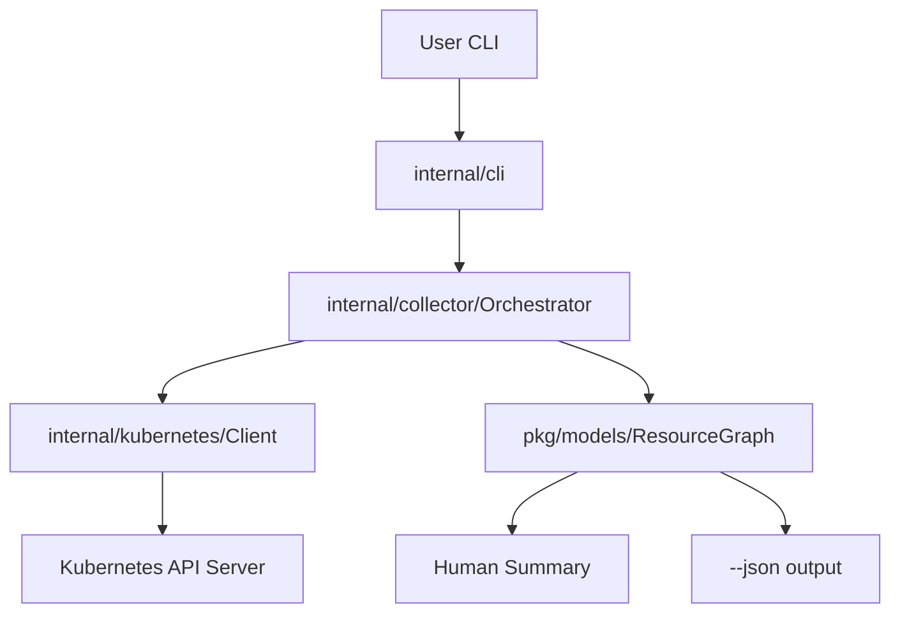
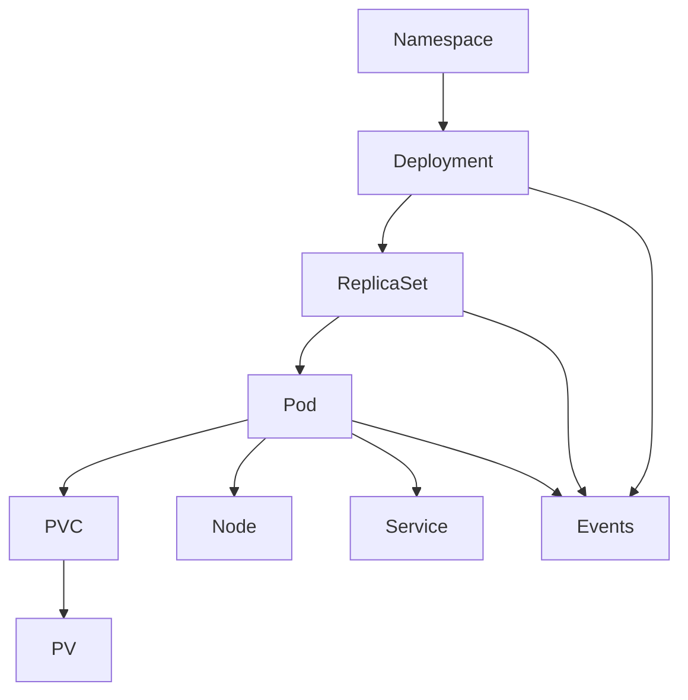

# ktrace Architecture

This document describes the architecture of ktrace as of Phase 1.

## Mission

ktrace answers three questions for any Kubernetes resource:

1. **What happened?** — chronological timeline of events and state changes
2. **Why did it happen?** — correlated root-cause analysis (Phase 2+)
3. **What should I fix?** — actionable recommendations (Phase 2+)

Phase 1 focuses on **resource collection** — gathering all related objects from the API server into a structured graph.

## Package Map

### Current (Phase 1)

| Package | Responsibility |
|---------|----------------|
| `cmd/ktrace` | CLI entrypoint |
| `internal/cli` | Cobra commands, flags, human summary and JSON output |
| `internal/kubernetes` | REST config loading, clientset wrapper |
| `internal/collector` | Per-kind collectors and orchestrator graph walk |
| `pkg/models` | Domain types: `ResourceRef`, `ResourceGraph`, `TimelineEvent` |
| `pkg/errors` | Typed errors for CLI exit codes |
| `pkg/utils` | Kind normalization, label selector matching, string helpers |

### Planned (Phase 2+)

| Package | Responsibility |
|---------|----------------|
| `internal/correlator` | Link resources with explicit edges and relations |
| `internal/analyzer` | Modular failure detection rules |
| `internal/timeline` | Build sorted, deduplicated timeline from graph |
| `internal/explain` | Root-cause synthesis from analyzer results |
| `internal/renderer` | Console, JSON, Markdown, HTML output |
| `internal/cache` | Optional collection cache |
| `internal/exporter` | PDF, Slack, GitHub Actions export |

## Data Flow



## Collection Graph

When tracing a Deployment, the orchestrator walks this graph:



Discovery mechanisms:

- **Owner references** — Deployment → ReplicaSet → Pod
- **Pod spec** — PVC claim names, nodeName
- **PVC spec** — bound PV name
- **Service selectors** — match Pod labels
- **Events API** — involvedObject name/UID matching

## Collector Design

Each resource kind has its own file in `internal/collector/`:

- `deployment.go`, `replicaset.go`, `pod.go`
- `event.go`, `pvc.go`, `pv.go`, `node.go`, `service.go`, `namespace.go`
- `orchestrator.go` — coordinates the walk from a root resource

Collectors return `models.CollectedResource` with a JSON snapshot of the raw API object. This snapshot feeds future analyzers without re-querying the API.

## Extension Points

### Phase 2: Correlator

The orchestrator already produces a complete `ResourceGraph`. The correlator will add explicit edges:

```go
type Edge struct {
    From     models.ResourceRef
    To       models.ResourceRef
    Relation string // "owns", "schedules", "mounts", "selects"
}
```

### Phase 2: Analyzer

Analyzers register as functions over the graph:

```go
type Rule func(graph *models.ResourceGraph) []Finding
```

Each rule detects a condition (e.g. `CrashLoopBackOff`), explains it, and suggests fixes.

### Phase 2: Renderer

Output formatting moves from `internal/cli/output.go` to `internal/renderer/`. The CLI passes a `ResourceGraph` (and later `AnalysisResult`) to the renderer — business logic never formats strings.

## Error Handling

- Collectors wrap API errors; `NotFound` becomes `pkg/errors.ErrNotFound`
- CLI exits: `0` success, `1` runtime error, `2` usage/unsupported kind
- All network calls accept `context.Context` for cancellation

## Testing

- Unit tests use `client-go/fake` clientset with programmatic fixtures
- Orchestrator integration test validates full graph collection
- Benchmarks cover orchestrator and event collection paths

## Security

- Uses standard kubeconfig / in-cluster credentials (same as kubectl)
- Read-only API access (list/get only, no mutations)
- No secrets are logged or included in output beyond what the API returns
